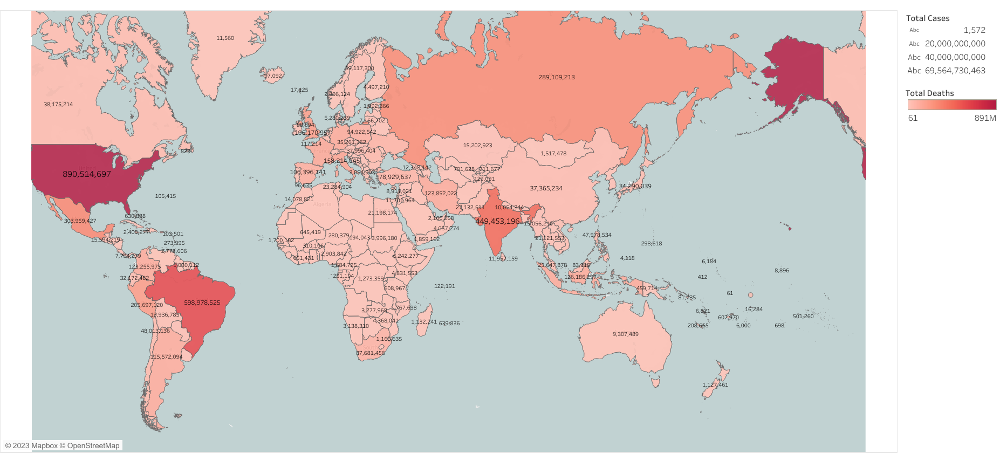

##MYSQL Practices for Data Analysis

This repository focuses on creating different queries for Data Analysis and SQL practice.
A Tableau peoject was made from the data given from this [Repo](https://ourworldindata.org/covid-deaths).
and was downloaded August 2023.

[Tableu Link](https://public.tableau.com/app/profile/miguel.figarola/viz/CovidVisualization_16932680165500/CasesandDeaths#1)

