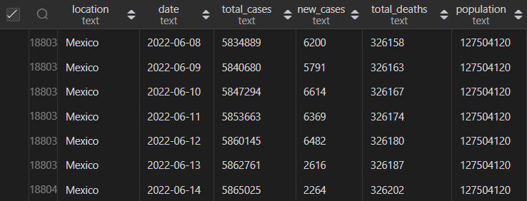

# <h1 align="center">MySQL Practices for Data Analysis 

This repository focuses on creating different queries for Data Analysis and SQL practice.
A [Tableu Project](https://public.tableau.com/app/profile/miguel.figarola/viz/CovidVisualization_16932680165500/CasesandDeaths#1) was made from the data given from this [Repo](https://ourworldindata.org/covid-deaths).
and was downloaded August 2023.

# Data
The data given was from COVID in which we can devide into vaccination data and deaths data in CSV files. 
Date formatting was given in Excel in order to have YYYY-MM-DD insted of DD/MM/YYYY for SQL purposes. 
* (Home -> Number -> Date).

# Data Exploration
Data exploration is important to understand the context of a problem and find patterns in a given dataset.
the query file contains different ways to visualize the table for different purposes and exploration.

# Importing Data
Some workbench can import CSV files pretty easy and rapidly, on my case I used MySQL Workbench CE 8.0
and was not allowed to import it smoothly so the python script on 'Others' folder converts CSV to SQL files.
(Keep in mind that the data types are all TEXT and require to change the type or cast it altering the tables).
* Run the 'deaths.sql' and 'vaccs.sql' query to import the data or import directly the CSV.

# Data Visualization
Visualizing the data is important to perform different analysis and get to conclusions. Therefore,
a map was created with Tableau in which we can see the countries in which
more cases and deaths were registered. The redd-ish countries got more deaths than the white-ish ones.

# Bibliography
Edouard Mathieu, Hannah Ritchie, Lucas Rodés-Guirao, Cameron Appel, Charlie Giattino, Joe Hasell, Bobbie Macdonald, Saloni Dattani, Diana Beltekian, Esteban Ortiz-Ospina and Max Roser (2020) - "Coronavirus Pandemic (COVID-19)". Published online at OurWorldInData.org. Retrieved from: 'https://ourworldindata.org/coronavirus' [Online Resource]
